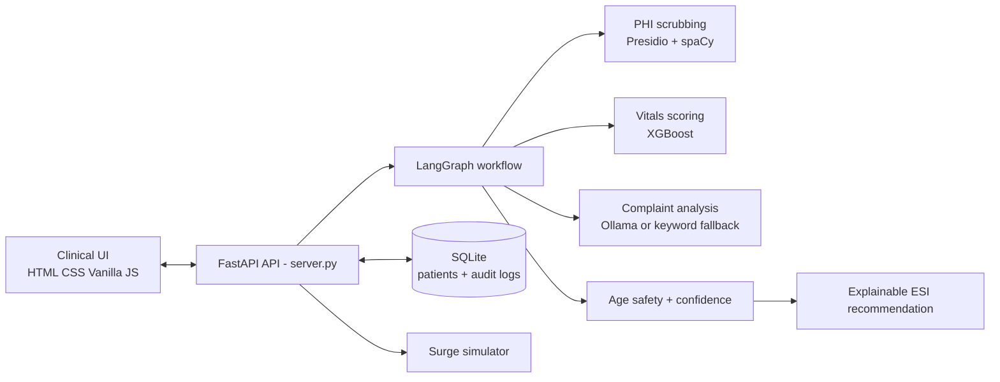

# PatientTriage.ai

## Explainable AI for faster, safer emergency-department triage

PatientTriage.ai is a human-in-the-loop decision-support prototype for emergency departments. It combines vital-sign scoring, clinical complaint analysis, deterministic age-safety rules, confidence-aware escalation, persistent audit trails, and live queue monitoring in one operational workflow.

The goal is simple: help clinical teams notice risk earlier without hiding the reasoning or taking the decision away from the clinician.

> **Hackathon prototype and decision-support system.** PatientTriage.ai is not a diagnostic device and must not be used for autonomous clinical decisions or real patient care.

## Why it matters

Emergency departments operate under time pressure, incomplete information, and changing queue conditions. A patient can be under-triaged because a presentation is atypical, or become more urgent while waiting.

PatientTriage.ai addresses those pressures with four deliberate design choices:

- **Two complementary signals:** structured vitals are scored with an inline-trained XGBoost model while the chief complaint is analyzed for clinical red flags and urgency cues.
- **Safety before convenience:** pediatric and geriatric patients with concerning vitals can trigger deterministic safety escalation, independent of model confidence.
- **Confidence is visible:** missing data, NLP ambiguity, and model margin contribute to a composite confidence score. Low confidence can escalate the suggested ESI level for review.
- **The clinician stays in control:** staff can accept or override every recommendation, and both actions are written to a SQLite audit log with the reason for overrides.

## What the demo shows

1. A queue of 20 realistic synthetic emergency-department cases loads automatically.
2. Each case displays demographics, vitals, ESI recommendation, confidence, explainability factors, and a pipeline trace.
3. A clinician accepts or overrides the recommendation.
4. The decision and supporting metadata are recorded in the audit log.
5. A surge control injects 15 additional synthetic patients for volume testing.
6. ESI 3 patients waiting at least 60 minutes are visually escalated to ESI 2 in the queue.
7. New walk-in patients can be registered and triaged through the same workflow.

## Architecture



### Triage workflow

```text
Patient input
    -> PHI scrubbing
    -> vital-sign scoring
    -> clinical complaint analysis
    -> age and safety checks
    -> composite confidence calculation
    -> final ESI synthesis and explainability
    -> database persistence and clinician review
```

### Confidence model

The workflow combines model confidence, data completeness, and NLP clarity:

$$
\text{Confidence} = 0.50 \times \text{ML margin}
                  + 0.30 \times (1 - \text{missing-data penalty})
                  + 0.20 \times (1 - \text{NLP ambiguity})
$$

If confidence falls below 60%, the workflow escalates the ESI suggestion by one level for additional clinical attention. This is a prototype safety heuristic, not a clinical protocol.

### Dynamic waiting queue (Phase 2)

Patients remain backend-owned waiting records after initial triage. A lightweight
FastAPI background task scans active `WAITING` records, calculates elapsed time,
compares it with a configurable severity threshold, and moves the record to
`REASSESSMENT_REQUIRED` when the threshold is exceeded. The monitor creates one
structured safety event per trigger, so polling is idempotent.

Wait thresholds are configured per hospital with `WAIT_THRESHOLDS_JSON`, for example:

```text
WAIT_THRESHOLDS_JSON={"1":0,"2":10,"3":30,"4":60,"5":120}
QUEUE_MONITOR_INTERVAL_SECONDS=60
```

Wait-time thresholds are configurable prototype safety parameters and must be
clinically validated before production use. Waiting time never outranks critical
safety conditions. New vitals flow through the existing Phase 1 triage pipeline;
meaningful deterioration generates a reassessment event. The system recommends
reassessment, while clinicians retain the final decision and acknowledgment.

### Clinician dashboard and accountability (Phase 3)

The browser dashboard presents AI recommendations as decision support, including
confidence in the recommendation, safety flags, missing information, wait status,
and recommended action. The selected-patient detail view keeps the reasoning and
clinician actions together. Overrides require a new triage level, a standardized
reason code, and a short clinician explanation; failed network writes are not
shown as successful decisions.

Accept and override actions are written to both the legacy decision log and the
structured safety-event stream. The audit view combines system and clinician
events chronologically while omitting raw complaint text. No authentication is
implemented in this prototype, so `clinician` is an audit actor placeholder for
future identity integration.

## Technology

- **Frontend:** HTML5, CSS, vanilla JavaScript (`frontend/`)
- **API:** FastAPI and Uvicorn (`server.py`)
- **Workflow orchestration:** LangGraph (`workflow.py`)
- **Structured ML:** XGBoost trained at startup on deterministic synthetic data
- **Complaint analysis:** local Ollama/Llama 3 when available, with a deterministic keyword fallback
- **PHI scrubbing:** Microsoft Presidio with the `en_core_web_sm` spaCy model
- **Persistence:** SQLite through SQLAlchemy (`backend/database.py`)
- **Alternative dashboard:** Streamlit
- **Testing:** pytest and FastAPI `TestClient`

## Repository layout

```text
.
├── server.py                    # FastAPI app, API routes, startup, static serving (main entry point)
├── workflow.py                  # LangGraph nodes and sequential fallback pipeline
├── ml_engine.py                 # XGBoost, NLP analysis, and PHI scrubbing
├── surge_simulator.py           # Synthetic surge-patient generator
├── streamlit_app.py             # Alternative Streamlit interface
├── patients.json                # 20 synthetic demo patients
├── requirements.txt             # Python dependencies and spaCy model
├── pytest.ini                   # pytest config (rootdir on path, warnings filtered)
├── test_api.py                  # End-to-end API and workflow test
├── test_workflow_routing.py     # Workflow routing tests
│
├── frontend/
│   ├── index.html                # Main browser application
│   ├── app.js                    # Frontend state, rendering, API calls, queue interactions
│   └── styles.css                # UI design system and responsive layout
│
├── backend/
│   ├── database.py               # SQLAlchemy models, patient persistence, audit operations
│   ├── queue_monitor.py          # Background wait-time / reassessment monitor
│   ├── clinical_rules.py         # Age-group classification and age-adjusted vital thresholds
│   ├── langgraph_orchestrator.py # LangGraph orchestration used by the backend test suite
│   ├── data/
│   │   └── golden_dataset.py     # Golden dataset loader helpers
│   └── tests/                    # Phase-based backend test suite (see Testing below)
│
├── data/
│   ├── golden/
│   │   ├── golden_patients.csv
│   │   └── golden_patients.json  # 22-patient golden safety-evaluation dataset
│   └── triage_simulation_data.csv
│
├── scripts/
│   ├── validate_golden_dataset.py
│   └── seed_golden_dataset.py
│
└── evaluation/
    ├── evaluate_golden_dataset.py
    └── results/
        ├── golden_dataset_results.json
        └── golden_dataset_report.md
```

## Run it locally

### Prerequisites

- Python 3.10 or newer
- Node.js 18 or newer for JavaScript syntax validation
- Optional: Ollama with the `llama3` model for local LLM complaint analysis

### 1. Create and activate a virtual environment

Windows PowerShell:

```powershell
py -3.12 -m venv .venv
.\.venv\Scripts\Activate.ps1
```

macOS/Linux:

```bash
python3 -m venv .venv
source .venv/bin/activate
```

### 2. Install dependencies

```bash
python -m pip install --upgrade pip
python -m pip install -r requirements.txt
```

The requirements include LangGraph, pytest, Streamlit, Presidio, and the spaCy English model used by Presidio.

### 3. Start the main application

```bash
python server.py
```

Open [http://localhost:8000](http://localhost:8000).

The server initializes SQLite, trains the XGBoost model, and seeds the 20 demo patients when the database is empty.

### 4. Run the automated verification

```bash
python -m pytest -q
```

`pytest.ini` sets `pythonpath = .`, so this discovers and runs the full suite: the root-level `test_api.py` and `test_workflow_routing.py`, plus the phase-based suite in `backend/tests/` (safety rules, queue/wait-threshold behavior, clinician overrides, golden-dataset scenarios, security, and observability). Expect on the order of 100 test cases; exact counts will drift as the suite grows, so treat `pytest -q`'s own summary line as the source of truth rather than any number written here.

### 5. Validate the frontend JavaScript

```bash
node --check frontend/app.js
```

### 6. Run the alternative Streamlit dashboard

```bash
streamlit run streamlit_app.py
```

Open [http://localhost:8501](http://localhost:8501).

### Optional: enable local LLM analysis

Install [Ollama](https://ollama.com), then start the model:

```bash
ollama run llama3
```

PatientTriage.ai automatically uses the local Ollama endpoint when it is available. If it is unavailable, the built-in keyword-based clinical NLP fallback keeps the demo operational.

## API reference

| Method   | Endpoint                                              | Purpose                                          |
| -------- | ------------------------------------------------------ | ------------------------------------------------ |
| `GET`    | `/`                                                    | Serve the main web application                   |
| `GET`    | `/api/patients`                                        | Return the queue sorted by effective priority    |
| `POST`   | `/api/patients`                                        | Register and triage a new patient                |
| `POST`   | `/api/accept/{patient_id}`                             | Accept an AI recommendation and log the decision |
| `POST`   | `/api/override/{patient_id}`                           | Assign a nurse ESI and log the reason            |
| `POST`   | `/api/surge`                                           | Inject 15 synthetic surge patients               |
| `GET`    | `/api/audit-log`                                       | Return recent decisions and audit statistics     |
| `GET`    | `/api/stats`                                           | Return queue counts and average wait time        |
| `GET`    | `/api/trace/{patient_id}`                              | Return the patient workflow trace                |
| `GET`    | `/api/queue`                                           | Return the active backend-sorted waiting queue   |
| `GET`    | `/api/patients/{patient_id}/status`                    | Return lifecycle and waiting status              |
| `GET`    | `/api/patients/{patient_id}/reassessment`              | Return reassessment state and safety events      |
| `POST`   | `/api/patients/{patient_id}/vitals`                    | Record vitals and run deterioration reassessment |
| `POST`   | `/api/patients/{patient_id}/reassessment`              | Request clinician reassessment                   |
| `POST`   | `/api/patients/{patient_id}/reassessment/acknowledge`  | Acknowledge a safety alert                       |
| `POST`   | `/api/reset`                                           | Clear the patient queue                          |
| `DELETE` | `/api/patients`                                        | Clear the patient queue                          |
| `POST`   | `/api/seed`                                            | Load the 20 demo patients again                  |

Example registration request:

```json
{
  "age": 72,
  "gender": "M",
  "chief_complaint": "Sudden chest tightness and shortness of breath.",
  "heart_rate": 115,
  "blood_pressure_sys": 160,
  "blood_pressure_dia": 95,
  "oxygen_saturation": 91,
  "respiratory_rate": 24,
  "temperature": 37.2,
  "gcs_score": 15
}
```

Example override request:

```json
{
  "nurse_esi": 2,
  "override_reason": "Clinical assessment differs from AI recommendation"
}
```

## Golden Synthetic Dataset & Safety Evaluation (Phase 4/5)

### 1. Synthetic Data & Privacy Assurance
All patient records across `data/golden/golden_patients.csv`, `data/golden/golden_patients.json`, and database seeds are **100% synthetic demonstration data**. No real patient data, medical record numbers (MRNs), or protected health information (PHI) are used. Identifiers use obvious demonstration prefixes (`DEMO-P001` through `DEMO-P022`).

### 2. Dataset Structure & Scenario Coverage
The canonical Golden Dataset contains **22 synthetic patients** covering all **20 required clinical safety scenarios**:

| # | Scenario Tag | Key Characteristics | Simulated Expected Safety Behavior |
|---|---|---|---|
| 1 | `PEDIATRIC_AGE_ADJUSTMENT` | 8-year-old with fever (38.5°C) & lethargy | Age-adjusted pediatric profile applies; conservative handling |
| 2 | `GERIATRIC_AMBIGUOUS_ZERO_HISTORY` | 75-year-old, vague chest discomfort, no history | Geriatric profile, low confidence, conservative escalation |
| 3 | `VITALS_OVERRIDE_NLP` | Tiny scratch reported, but vitals in shock | Deterministic safety rule overrides low-risk NLP (ESI 1) |
| 4 | `ZERO_HISTORY` | First-time patient with zero previous records | History unavailable; confidence reflects limited context |
| 5 | `RICH_HISTORY` | Patient with complete, consistent records | Rich history available; higher confidence baseline |
| 6 | `PARTIAL_HISTORY` | Partial records with missing medication history | Partial context; medium confidence |
| 7 | `AMBIGUOUS_PRESENTATION` | Vague, non-specific symptoms | NLP ambiguity penalizes confidence; requests review |
| 8 | `MISSING_VITAL` | Shortness of breath with missing SpO2 | Missing vital tracked; never assumed to be normal |
| 9 | `CONFLICTING_SIGNALS` | NLP suggests minor scratch, vitals show hypoxia | Safety rule precedence forces high-urgency triage |
| 10 | `HIGH_CONFIDENCE` | Complete data with severe crushing chest pain | Clear presentation & complete vitals yield high confidence |
| 11 | `LOW_CONFIDENCE` | Weakness & dizziness with zero history | High uncertainty yields low confidence & escalation |
| 12 | `WAIT_THRESHOLD` | Patient waiting in queue exceeds safe threshold | Queue monitor flags `REASSESSMENT_REQUIRED` |
| 13 | `VITAL_DETERIORATION` | Initially stable patient whose vitals worsen | Deterioration detected; re-triaged and escalated |
| 14 | `CRITICAL_SAFETY_RULE` | Immediate life-threat vital signs | Deterministic rule produces ESI 1 priority alert |
| 15 | `PEDIATRIC_MISSING_DATA` | 4-year-old with missing medication history | Age-adjusted rules + partial context handling |
| 16 | `GERIATRIC_RICH_HISTORY` | 68-year-old on anticoagulants with dark stools | Geriatric risk flagged with rich context |
| 17 | `STABLE_LOW_RISK` | Minor stable cut with complete information | Non-urgent ESI 5 with high confidence |
| 18 | `CLINICIAN_OVERRIDE` | Borderline case designed for clinician override | Reasonable AI recommendation; clinician demonstrates override |
| 19 | `CLINICIAN_ACCEPT` | Routine refill request | Stable low-risk case for clinician accept workflow |
| 20 | `MULTI_FACTOR_RISK` | Age risk + abnormal vitals + zero history | Concurrent multi-domain risk triggers ESI 1 alert |

### 3. Execution Commands

#### A. Validate Dataset Integrity
```bash
python scripts/validate_golden_dataset.py
```
Validates record count (>=20), ID uniqueness, scenario coverage (20/20 tags), valid ranges, anchor cases, and privacy rules.

#### B. Seed Dataset into Database
```bash
python scripts/seed_golden_dataset.py --reset-golden
```
Idempotently loads the 22 synthetic patients into SQLite using application database models without modifying unrelated records.

#### C. Run Complete Safety Evaluation Pipeline
```bash
python evaluation/evaluate_golden_dataset.py
```
Executes the real `PatientTriage.ai` pipeline (LangGraph + ML + Safety Rules) against every synthetic patient and produces:
- Machine-readable results: `evaluation/results/golden_dataset_results.json`
- Human-readable report: `evaluation/results/golden_dataset_report.md`

### 4. Latest Evaluation Results

The most recent run against the 22-patient golden dataset (`evaluation/results/golden_dataset_report.md`):

| Metric | Result |
|---|---:|
| Dataset size | 22 records |
| Scenario coverage | 20 / 20 tags |
| Under-triage rate (overall) | 27.3% (6 cases) |
| Over-triage rate | 18.2% (4 cases) |
| Exact triage agreement | 54.5% (12 cases) |
| Safety rule trigger rate | 68.2% (15 cases) |
| Low confidence rate | 4.5% (1 case) |
| Conservative escalation rate | 59.1% (13 cases) |
| Critical under-triage (ESI 1 expected, higher predicted) | 0 cases |
| Critical safety rule misses | 0 cases |
| Pediatric / geriatric / zero-history routing | ✅ Pass |
| Data leakage check | ✅ Clean |

The headline safety result is that **no critical (ESI 1) cases were under-triaged and no deterministic safety rule was missed** in this run. The overall under-triage rate of 27.3% is measured against the golden dataset's simulated expected levels (not real clinical ground truth) and is exactly the kind of gap this prototype is designed to surface — it's a target for tuning the confidence thresholds and NLP rules before any further validation, not a claim of production readiness. Re-run `python evaluation/evaluate_golden_dataset.py` after any pipeline change to regenerate these numbers.

### 5. Safety Metrics & Why Under-Triage is the Critical Metric
In emergency medicine, **under-triage** (assigning a critically ill patient to a low-urgency category) can cause life-threatening delays, whereas **over-triage** results only in safe conservative review. Therefore, PatientTriage.ai treats **under-triage minimization** as its primary safety objective rather than ordinary accuracy.

The evaluation pipeline tracks:
1. **Under-Triage Rate**: Percentage of cases assigned a lower urgency than expected (minimized by deterministic safety overrides).
2. **Over-Triage Rate**: Measured conservative bias under diagnostic uncertainty.
3. **Exact Triage Agreement**: Concordance with baseline simulated levels.
4. **Safety Rule Trigger Rate**: Percentage of cases activating deterministic age or vital overrides.
5. **Low Confidence Rate**: Proportion of uncertain cases flagged for mandatory clinical review.
6. **Routing Correctness**: 100% accuracy for pediatric, geriatric, and zero-history routing.

### 6. Prototype Disclaimer & No Medical Claims
> [!CAUTION]
> **NOT CLINICALLY VALIDATED FOR MEDICAL DIAGNOSIS**: All clinical thresholds (e.g. 38.5°C fever, SpO2 thresholds) and simulated expected outputs represent prototype safety design assumptions. They are intended solely for demonstrating age-aware and uncertainty-aware algorithmic behavior and must undergo rigorous clinical validation before any real-world healthcare deployment.

## Responsible AI and privacy

- All bundled patient records are synthetic demonstration data.
- Complaint text is scrubbed before NLP processing when Presidio is available.
- The system exposes recommendation factors and workflow traces instead of presenting an unexplained score.
- Clinicians retain accept and override authority.
- Audit records capture AI ESI, confidence, nurse ESI, action type, override reason, and escalation flags.
- Ollama is local by design; no external LLM API is required for the fallback demo.
- This prototype has not been clinically validated, safety-certified, or approved for production use.

## Verification status

The pytest suite spans 14 files (2 at the project root, 12 under `backend/tests/`) covering roughly 100 test cases: end-to-end API flow, workflow routing, Phase 1 safety rules, Phase 2 queue/wait-threshold behavior, Phase 3 clinician overrides, golden-dataset scenarios, Phase 5 evaluation/regression, Phase 6 security, and Phase 7 observability. Run `python -m pytest -q` and use its own summary line as the current source of truth for pass/fail counts, since the suite is still growing.

```text
LangGraph enabled
Presidio enabled with en_core_web_sm
Streamlit import and launcher working
Node.js frontend/app.js syntax check requires Node.js to be installed
```

The test run emits deprecation warnings from FastAPI, Starlette/httpx, and SQLAlchemy; `pytest.ini` filters most of these. They do not currently prevent the application or test suite from working.

## Product direction

The next production-minded steps would be:

- reconcile `backend/core/` (used only by `backend/tests/`) with the live pipeline in `workflow.py`, or remove it, so there is a single source of truth for triage logic;
- validate the triage logic with qualified clinical stakeholders and curated, governed datasets;
- replace startup training on synthetic data with a versioned, validated model pipeline;
- add authentication, role-based access, encrypted storage, and deployment monitoring;
- migrate lifecycle code to FastAPI lifespan handlers and timezone-aware timestamps;
- add browser-level tests for responsive UI behavior and accessibility;
- define measurable outcomes such as time-to-triage, override rate, calibration, and under-triage sensitivity.

## Team positioning

PatientTriage.ai is designed as a practical enterprise prototype: explainable enough for review, modular enough to extend, and deliberately human-centered for a high-stakes workflow.

Built for hackathon evaluation with synthetic data and local-first development.